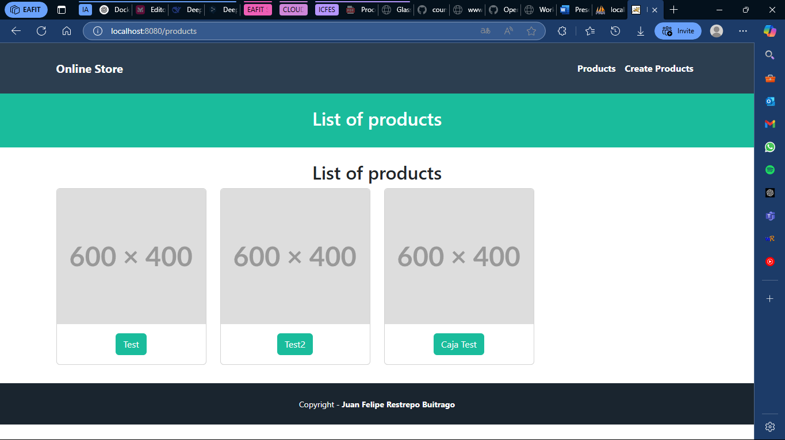
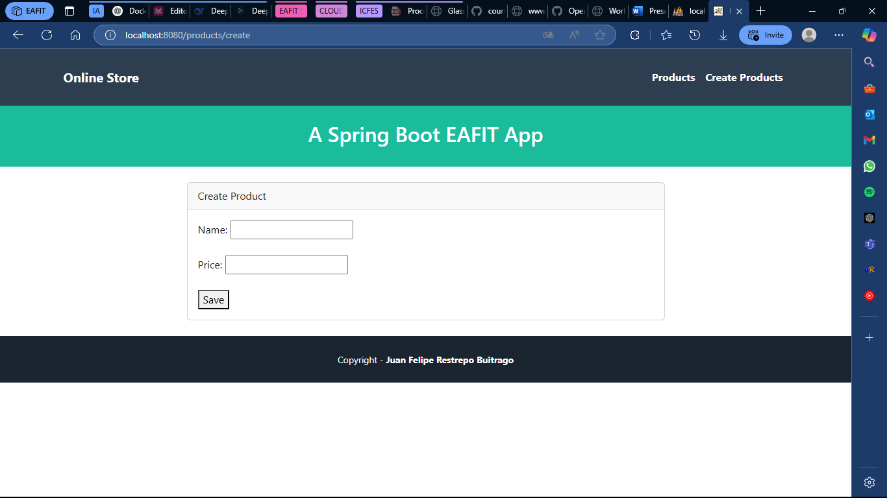
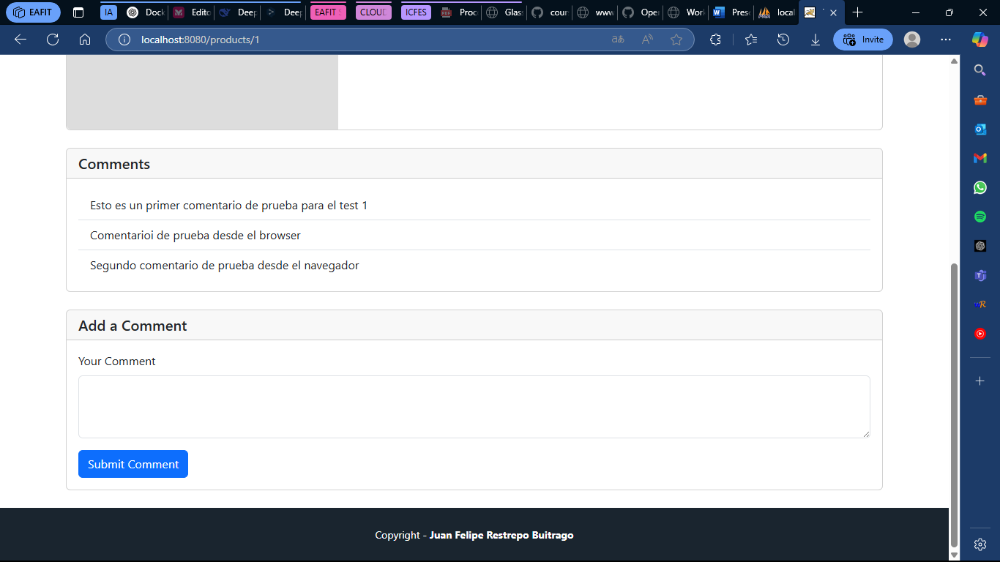

# Tutorial 07: Spring Boot Controllers and Views

## Content Table
- [Tutorial 07: Spring Boot Controllers and Views](#tutorial-07-spring-boot-controllers-and-views)
  - [Content Table](#content-table)
  - [Authors](#authors)
  - [Introduction](#introduction)
  - [Project Structure](#project-structure)
  - [Setup Instructions](#setup-instructions)
    - [Versions](#versions)
    - [Requirements](#requirements)
    - [Execution](#execution)
  - [Activities](#activities)
    - [Tutorial Evidence](#tutorial-evidence)
      - [`/products` route](#products-route)
      - [`/products/create` route](#productscreate-route)
      - [`/products/{id}` route](#productsid-route)
      - [`/products/{id}` route with comments](#productsid-route-with-comments)
    - [Activity](#activity)
  - [Contact](#contact)


## Authors

- Juan Felipe Restrepo Buitrago

## Introduction

This folder contains the project in which the 07 tutorial of the Special Topics in Software Engineering Course is developed. This tutorial is about the creation of a Spring Boot views, models and controllers. Furthermore, we learnt how to connect a database to spring boot and how to manage the models correctly in the application. 

## Project Structure

. \
├── .mvn \
│ ├── wrapper \
│ │ └── maven-wrapper.properties # Maven wrapper properties. \
├── evidence # Folder with all the evidence images \
├── src \
│ ├── main \
│ │ ├── java \
│ │ │ ├── com \
│ │ │ │ ├── eafit \
│ │ │ │ │ ├── tutorial07 \
│ │ │ │ │ │ ├── controllers \
│ │ │ │ │ │ │ ├── CommentController.java # Comments controller. \
│ │ │ │ │ │ │ └── ProductController.java # Products controller. \
│ │ │ │ │ │ ├── models \
│ │ │ │ │ │ │ ├── CommentController.java # Comments controller. \
│ │ │ │ │ │ │ └── ProductController.java # Products controller. \
│ │ │ │ │ │ ├── repositories \
│ │ │ │ │ │ │ ├── CommentRepository.java # Comments repository. \
│ │ │ │ │ │ │ └── ProductRepository.java # Products repository. \
│ │ │ │ │ │ └── Tutorial07Application.java # Application main class. \
│ │ ├── resources \
│ │ │ ├── static \
│ │ │ │ ├── css \
│ │ │ │ │ └── app.css # CSS file. \
│ │ │ ├── templates \
│ │ │ │ ├── fragments \
│ │ │ │ │ ├── footer.html # Footer fragment. \
│ │ │ │ │ └── header.html # Header fragment. \
│ │ │ │ ├── product \
│ │ │ │ │ ├── create.html # Create product page. \
│ │ │ │ │ ├── index.html # Products page. \
│ │ │ │ │ └── show.html # Product page. \
│ │ │ └── application.properties # Application properties. \
│ ├── test \
│ │ ├── java \
│ │ │ ├── com \
│ │ │ │ ├── eafit \
│ │ │ │ │ ├── tutorial07 \
│ │ │ │ │ │ └── Tutorial07ApplicationTests.java # Application tests. \
├── docker-compose.yaml # Docker compose file. \
├── .gitignore # Git ignore file. \
├── HELP.md # Help file. \
├── mvnw # Maven wrapper. \
├── mvnw.cmd # Maven wrapper. \
├── pom.xml # Maven dependencies. \
└── README.md # Readme file. \

## Setup Instructions

### Versions

This were the versions used to develop the project:

- Java 21
- Maven 3.9.9 (Optional)
- Spring Boot 3.4.2 (Optional)

### Requirements

To run this project you will need mysql running on your machine in the `localhost:3306` with a database named `tutorial07_teds` and a user with the following credentials: `username: root` and `password: 123`.

You can run mysql and phpmyadmin with the following `docker-compose.yaml` file and running the following command:

```bash
version: '3.8'

services:
  mysql:
    image: mysql:8.4.0
    container_name: mysql
    restart: always
    environment:
      MYSQL_ROOT_PASSWORD: 123
    ports:
      - "3306:3306"
    networks:
      - mysql_network

  phpmyadmin:
    image: phpmyadmin/phpmyadmin:latest
    container_name: phpmyadmin-container
    restart: always
    environment:
      PMA_HOST: mysql
      PMA_PORT: 3306
    ports:
      - "8081:80"
    networks:
      - mysql_network

volumes:
  mysql_instance_data:

networks:
  mysql_network:
    driver: bridge
```

```bash
cd $PROJECT_PATH/tutorials/tutorial07
docker-compose up -d
```


### Execution

To run follow these steps:

1. Clone the repository:

```bash
git clone git@github.com:JuanFelipeRestrepoBuitrago/Software-Topics.git
```
or

```bash
git clone https://github.com/JuanFelipeRestrepoBuitrago/Software-Topics.git
```

2. Go to the tutorial 1 folder:

```bash
cd $PROJECT_PATH/tutorials/tutorial07
```

3. Run the project:

```bash
mvn spring-boot:run
```
or in case you don't have maven installed:

```bash
./mvnw spring-boot:run
```

4. Open the browser and go to http://localhost:8080/products

## Activities

### Tutorial Evidence

#### `/products` route



#### `/products/create` route



#### `/products/{id}` route

![Product Route](evidence/product_view.png

#### `/products/{id}` route with comments


 
### Activity

Complete the code to save comments in the database with the proposed form in the product view.

#### Answer
I had to modify and add some things in the project to reach the desired functionality. 

1. I added the `Comment` class in the `ProductController` class. The code is shown below:

```java
import com.eafit.tutorial07.models.Comment;
```

2. I created the `CommentController` class to save the comments in the database. The code is shown below:

```java
package com.eafit.tutorial07.controllers;

import com.eafit.tutorial07.models.Comment;
import com.eafit.tutorial07.models.Product;
import com.eafit.tutorial07.repositories.CommentRepository;
import com.eafit.tutorial07.repositories.ProductRepository;

import org.springframework.beans.factory.annotation.Autowired;
import org.springframework.stereotype.Controller;
import org.springframework.web.bind.annotation.PathVariable;
import org.springframework.web.bind.annotation.RequestMapping;
import org.springframework.web.bind.annotation.PostMapping;
import org.springframework.web.bind.annotation.RequestParam;

@Controller
@RequestMapping("/products/{id}/comments")
public class CommentController {

    @Autowired
    private CommentRepository commentRepository;

    @Autowired
    private ProductRepository productRepository;

    @PostMapping
    public String saveComment(@PathVariable Long id, Comment comment) {
        // Validaciones mínimas
        if (comment.getDescription() == null || comment.getDescription().isEmpty()) {
            throw new RuntimeException("Description is required");
        }
        // Get the product with the given id
        Product product = productRepository.findById(id)
                .orElseThrow(() -> new RuntimeException("Product with id " + id + " not found"));

        // Add the comment to the product
        comment.setProduct(product);

        // Save the comment
        commentRepository.save(comment);

        return "redirect:/products/" + id;
    }
}
```

3. I modified the `/products/{id}` route mapped to the `show` method in the `ProductController` class to add the comments to the product. The code is shown below:

```java
model.addAttribute("comment", new Comment());
```

## Contact

For any questions or issues, feel free to reach out to:
- Juan Felipe Restrepo Buitrago: [jfrestrepb@eafit.edu.co](jfrestrepb@eafit.edu.co)