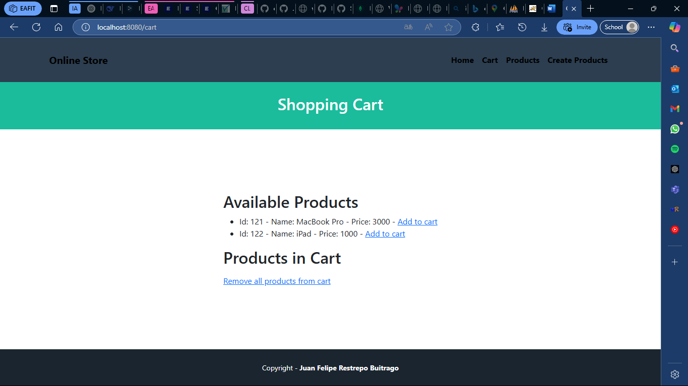

# Tutorial 09 A: Cart with Spring Boot

## Content Table
- [Tutorial 09 A: Cart with Spring Boot](#tutorial-09-a-cart-with-spring-boot)
  - [Content Table](#content-table)
  - [Authors](#authors)
  - [Introduction](#introduction)
  - [Project Structure](#project-structure)
  - [Setup Instructions](#setup-instructions)
    - [Versions](#versions)
    - [Requirements](#requirements)
    - [Execution](#execution)
  - [Activities](#activities)
    - [Activity 1](#activity-1)
    - [Activity 2](#activity-2)
    - [Activity 3](#activity-3)
    - [Activity 4](#activity-4)
    - [Activity 5](#activity-5)
    - [Activity 6](#activity-6)
  - [Contact](#contact)


## Authors

- Juan Felipe Restrepo Buitrago

## Introduction

This folder contains the project in which the 09 A tutorial of the Special Topics in Software Engineering Course is developed. This tutorial is about the creation of shopping cart in Spring Boot.

## Project Structure

```bash
. \
├── .mvn \
│ ├── wrapper \
│ │ └── maven-wrapper.properties # Maven wrapper properties. \
├── evidence # Folder with all the evidence images \
├── src \
│ ├── main \
│ │ ├── java \
│ │ │ ├── com \
│ │ │ │ ├── eafit \
│ │ │ │ │ ├── tutorial09a \
│ │ │ │ │ │ ├── controllers \
│ │ │ │ │ │ │ ├── CommentController.java # Comments controller. \
│ │ │ │ │ │ │ └── ProductController.java # Products controller. \
│ │ │ │ │ │ ├── models \
│ │ │ │ │ │ │ ├── CommentController.java # Comments controller. \
│ │ │ │ │ │ │ └── ProductController.java # Products controller. \
│ │ │ │ │ │ ├── repositories \
│ │ │ │ │ │ │ ├── CommentRepository.java # Comments repository. \
│ │ │ │ │ │ │ └── ProductRepository.java # Products repository. \
│ │ │ │ │ │ └── Tutorial09aApplication.java # Application main class. \
│ │ ├── resources \
│ │ │ ├── static \
│ │ │ │ ├── css \
│ │ │ │ │ └── app.css # CSS file. \
│ │ │ ├── templates \
│ │ │ │ ├── fragments \
│ │ │ │ │ ├── footer.html # Footer fragment. \
│ │ │ │ │ └── header.html # Header fragment. \
│ │ │ │ ├── product \
│ │ │ │ │ ├── create.html # Create product page. \
│ │ │ │ │ ├── index.html # Products page. \
│ │ │ │ │ └── show.html # Product page. \
│ │ │ └── application.properties # Application properties. \
│ ├── test \
│ │ ├── java \
│ │ │ ├── com \
│ │ │ │ ├── eafit \
│ │ │ │ │ ├── tutorial09a \
│ │ │ │ │ │ └── Tutorial09aApplicationTests.java # Application tests. \
├── docker-compose.yaml # Docker compose file. \
├── .gitignore # Git ignore file. \
├── HELP.md # Help file. \
├── mvnw # Maven wrapper. \
├── mvnw.cmd # Maven wrapper. \
├── pom.xml # Maven dependencies. \
└── README.md # Readme file. \
```

## Setup Instructions

### Versions

This were the versions used to develop the project:

- Java 21
- Maven 3.9.9 (Optional)
- Spring Boot 3.4.2 (Optional)

### Requirements

To run this project you will need mysql running on your machine in the `localhost:3306` with a database named `workshop1_teis` and a user with the following credentials: `username: root` and `password: 123`.

You can run mysql and phpmyadmin with the following `docker-compose.yaml` file in the project root:

```bash
version: '3.8'

services:
  mysql:
    image: mysql:8.4.0
    container_name: mysql
    restart: always
    environment:
      MYSQL_ROOT_PASSWORD: 123
    ports:
      - "3306:3306"
    networks:
      - mysql_network

  phpmyadmin:
    image: phpmyadmin/phpmyadmin:latest
    container_name: phpmyadmin-container
    restart: always
    environment:
      PMA_HOST: mysql
      PMA_PORT: 3306
    ports:
      - "8081:80"
    networks:
      - mysql_network

volumes:
  mysql_instance_data:

networks:
  mysql_network:
    driver: bridge
```

1. Go to the workshop1 folder:
```bash
cd $PROJECT_PATH/workshops/workshop1
```
2. Run the docker compose file:
```bash
docker-compose up
```
3. Open your browser and go to http://localhost:8081
4. Log in with the following credentials:
```bash
username: root
password: 123
```
If fails, try to log in again after a few seconds.
5. Create a new database named `tutorial09_teis`
6. Once you have finished running the project, you can stop the containers by running in the workshop1 folder:
```bash
docker-compose down
```

### Execution

To run follow these steps:

1. Clone the repository (If you already have the project, skip this step):

SSH
```bash
git clone git@github.com:JuanFelipeRestrepoBuitrago/Software-Topics.git
```
or HTTP

```bash
git clone https://github.com/JuanFelipeRestrepoBuitrago/Software-Topics.git
```

2. Go to the workshop1 folder:

```bash
cd $PROJECT_PATH/tutorials/tutorial09a
```

3. (Optional) To avoid dependency problems, run the following command:

```bash
mvn clean install
```
or in case you don't have maven installed:

```bash
./mvnw clean install
```

4. Run the project:

```bash
mvn spring-boot:run
```
or in case you don't have maven installed:

```bash
./mvnw spring-boot:run
```

5. Open the browser and go to http://localhost:8080/

## Activities
 
### Tutorial Evidence

The evidence of the tutorial can be found in the `evidence` folder. I completed all the tutorial and the following evidence is presented as proof:



## Contact

For any questions or issues, feel free to reach out to:
- Juan Felipe Restrepo Buitrago: [jfrestrepb@eafit.edu.co](jfrestrepb@eafit.edu.co)