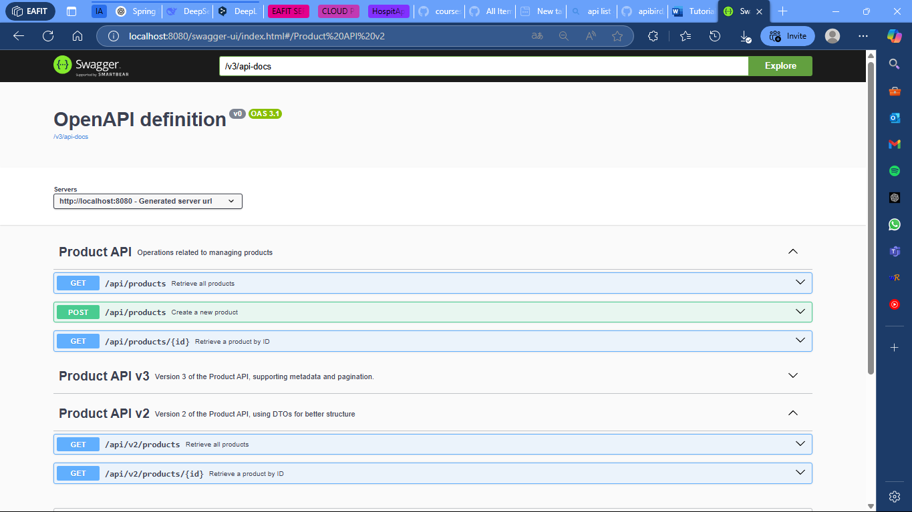
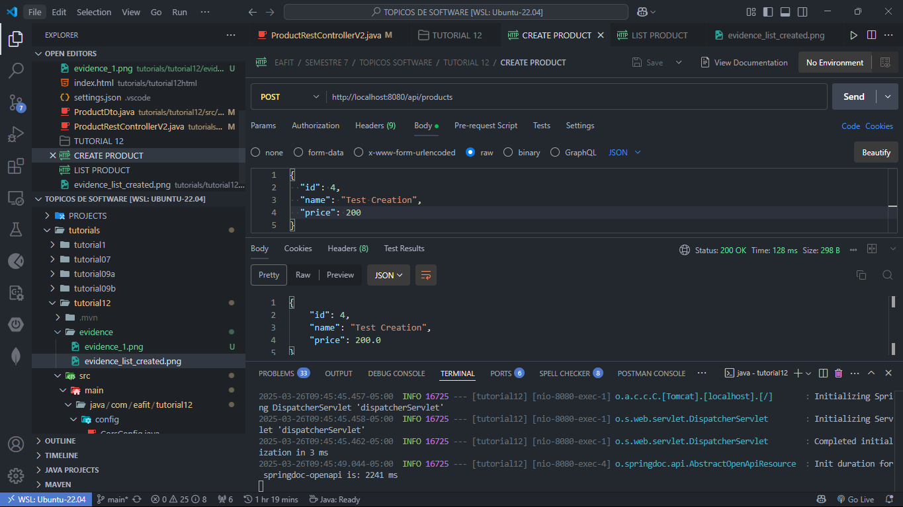
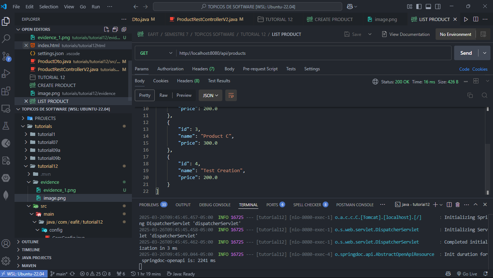

# Tutorial 12: Simple API System

## Content Table
- [Tutorial 12: Simple API System](#tutorial-12-simple-api-system)
  - [Content Table](#content-table)
  - [Authors](#authors)
  - [Introduction](#introduction)
  - [Project Structure](#project-structure)
  - [Setup Instructions](#setup-instructions)
    - [Versions](#versions)
    - [Execution](#execution)
  - [Activities](#activities)
    - [Tutorial Evidence](#tutorial-evidence)
    - [Activity 1](#activity-1)
      - [Answer](#answer)
  - [Contact](#contact)


## Authors

- Juan Felipe Restrepo Buitrago

## Introduction

This folder containes the project in which the 12th tutorial of the Special Topics in Software Engineering Course is developed. This tutorial is about the creation of a simple API system in Spring Boot.

## Project Structure

```bash
. \
├── .mvn \
│ ├── wrapper \
│ │ └── maven-wrapper.properties # Maven wrapper properties. \
├── evidence # Folder with all the evidence images \
├── src \
│ ├── main \
│ │ ├── java \
│ │ │ ├── com \
│ │ │ │ ├── eafit \
│ │ │ │ │ ├── tutorial12 \
│ │ │ │ │ │ ├── config \
│ │ │ │ │ │ │ └── CorsConfig.java # CORS configuration. \
│ │ │ │ │ │ ├── controllers \
│ │ │ │ │ │ │ ├── rest \
│ │ │ │ │ │ │ │ ├── ProductRestController.java # Products controller. \
│ │ │ │ │ │ │ │ ├── ProductRestControllerV2.java # Products controller V2. \
│ │ │ │ │ │ │ │ └── ProductRestControllerV3.java # Products controller V3. \
│ │ │ │ │ │ ├── models \
│ │ │ │ │ │ │ └── Product.java # Products model. \
│ │ │ │ │ │ ├── dto \
│ │ │ │ │ │ │ ├── ProductCollection.java # Products collection DTO. \
│ │ │ │ │ │ │ └── ProductDto.java # Products DTO. \
│ │ │ │ │ │ └── Tutorial12Application.java # Application main class. \
│ │ ├── resources \
│ │ │ └── application.properties # Application properties. \
│ ├── test \
│ │ ├── java \
│ │ │ ├── com \
│ │ │ │ ├── eafit \
│ │ │ │ │ ├── tutorial12 \
│ │ │ │ │ │ └── Tutorial12ApplicationTests.java # Application tests. \
├── .gitignore # Git ignore file. \
├── HELP.md # Help file. \
├── mvnw # Maven wrapper. \
├── mvnw.cmd # Maven wrapper. \
├── pom.xml # Maven dependencies. \
└── README.md # Readme file. \
```

## Setup Instructions

### Versions

This were the versions used to develop the project:

- Java 21
- Maven 3.9.9 (Optional)
- Spring Boot 3.4.2 (Optional)

### Execution

To run follow these steps:

1. Clone the repository (If you already have the project, skip this step):

SSH
```bash
git clone git@github.com:JuanFelipeRestrepoBuitrago/Software-Topics.git
```
or HTTP

```bash
git clone https://github.com/JuanFelipeRestrepoBuitrago/Software-Topics.git
```

2. Go to the workshop1 folder:

```bash
cd $PROJECT_PATH/tutorials/tutorial12
```

3. (Optional) To avoid dependency problems, run the following command:

```bash
mvn clean install
```
or in case you don't have maven installed:

```bash
./mvnw clean install
```

4. Run the project:

```bash
mvn spring-boot:run
```
or in case you don't have maven installed:

```bash
./mvnw spring-boot:run
```

5. Open the browser and go to http://localhost:8080/

## Activities
 
### Tutorial Evidence

The evidence of the tutorial can be found in the `evidence` folder. I completed all the tutorial and the following evidence is presented as proof:



### Activity 1

Implement a new endpoint to receive data (e.g. name and price of a product) through a POST request and store the new product (either in a database or in an in-memory list). And update comments and description in the swagger documentation.

#### Answer

I added the following endpoint to the `ProductRestController` class:

```java
    @Operation(
        summary = "Create a new product",
        description = "Adds a new product to the list.",
        responses = {
            @ApiResponse(responseCode = "200", description = "Product successfully created",
                         content = @Content(mediaType = "application/json",
                                            schema = @Schema(implementation = Product.class))),
            @ApiResponse(responseCode = "400", description = "Invalid input data")
        }
    )
    @PostMapping("/products")
    public ResponseEntity<Product> createProduct(
        @Parameter(description = "Product object to be created", required = true)
        @RequestBody Product product) {

        products.add(product);
        return ResponseEntity.ok(product);
    }
```





## Contact

For any questions or issues, feel free to reach out to:
- Juan Felipe Restrepo Buitrago: [jfrestrepb@eafit.edu.co](jfrestrepb@eafit.edu.co)