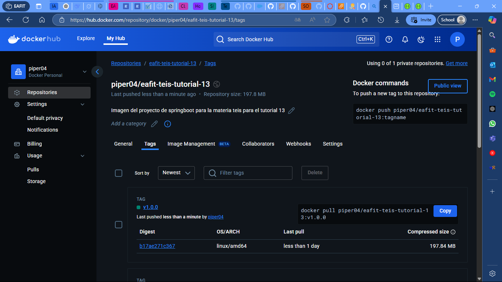
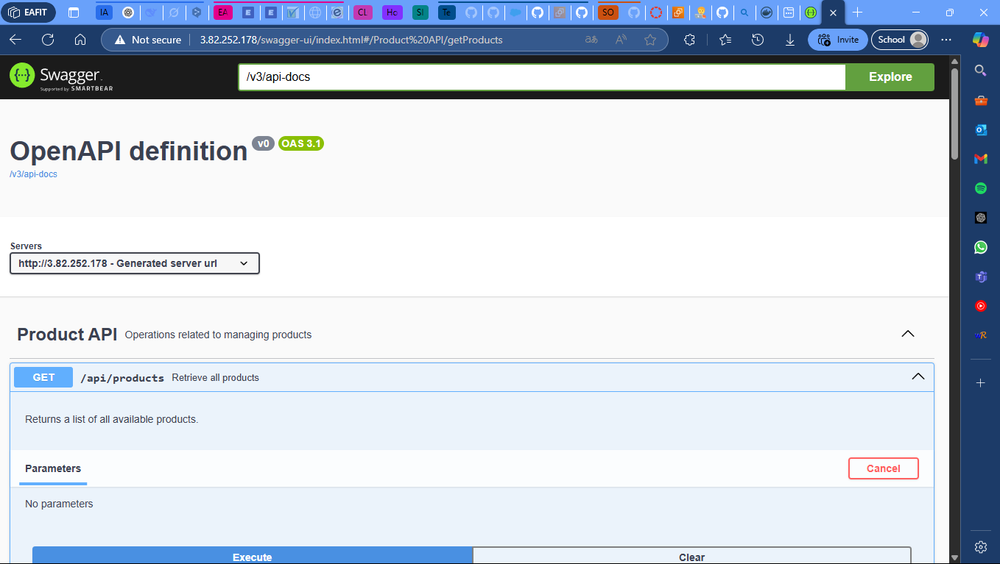

# Tutorial 13: Docker y AWS

## Content Table
- [Tutorial 13: Docker y AWS](#tutorial-13-docker-y-aws)
  - [Content Table](#content-table)
  - [Authors](#authors)
  - [Introduction](#introduction)
  - [Project Structure](#project-structure)
  - [Setup Instructions](#setup-instructions)
    - [Versions](#versions)
    - [Execution](#execution)
    - [Docker Image](#docker-image)
  - [Activities](#activities)
    - [Uploading to Docker Hub](#uploading-to-docker-hub)
    - [Uploading to AWS](#uploading-to-aws)
  - [Contact](#contact)


## Authors

- Juan Felipe Restrepo Buitrago

## Introduction

This folder contains the project in which the 12th tutorial of the Special Topics in Software Engineering Course is developed. This tutorial is about the creation of a simple API system in Spring Boot. The part of the tutorial 13 is to upload this API to Docker Hub and run it in AWS EC2. 

## Project Structure

```bash
. \
├── .mvn \
│ ├── wrapper \
│ │ └── maven-wrapper.properties # Maven wrapper properties. \
├── evidence # Folder with all the evidence images \
├── src \
│ ├── main \
│ │ ├── java \
│ │ │ ├── com \
│ │ │ │ ├── eafit \
│ │ │ │ │ ├── tutorial13 \
│ │ │ │ │ │ ├── config \
│ │ │ │ │ │ │ └── CorsConfig.java # CORS configuration. \
│ │ │ │ │ │ ├── controllers \
│ │ │ │ │ │ │ ├── rest \
│ │ │ │ │ │ │ │ ├── ProductRestController.java # Products controller. \
│ │ │ │ │ │ │ │ ├── ProductRestControllerV2.java # Products controller V2. \
│ │ │ │ │ │ │ │ └── ProductRestControllerV3.java # Products controller V3. \
│ │ │ │ │ │ ├── models \
│ │ │ │ │ │ │ └── Product.java # Products model. \
│ │ │ │ │ │ ├── dto \
│ │ │ │ │ │ │ ├── ProductCollection.java # Products collection DTO. \
│ │ │ │ │ │ │ └── ProductDto.java # Products DTO. \
│ │ │ │ │ │ └── tutorial13Application.java # Application main class. \
│ │ ├── resources \
│ │ │ └── application.properties # Application properties. \
│ ├── test \
│ │ ├── java \
│ │ │ ├── com \
│ │ │ │ ├── eafit \
│ │ │ │ │ ├── tutorial13 \
│ │ │ │ │ │ └── tutorial13ApplicationTests.java # Application tests. \
├── .gitignore # Git ignore file. \
├── HELP.md # Help file. \
├── Dockerfile # Dockerfile to build the image. \
├── mvnw # Maven wrapper. \
├── mvnw.cmd # Maven wrapper. \
├── pom.xml # Maven dependencies. \
└── README.md # Readme file. \
```

## Setup Instructions

### Versions

This were the versions used to develop the project:

- Java 21
- Maven 3.9.9 (Optional)
- Spring Boot 3.4.2 (Optional)

### Execution

To run follow these steps:

1. Clone the repository (If you already have the project, skip this step):

SSH
```bash
git clone git@github.com:JuanFelipeRestrepoBuitrago/Software-Topics.git
```
or HTTP

```bash
git clone https://github.com/JuanFelipeRestrepoBuitrago/Software-Topics.git
```

2. Go to the workshop1 folder:

```bash
cd $PROJECT_PATH/tutorials/tutorial13
```

3. (Optional) To avoid dependency problems, run the following command:

```bash
mvn clean install
```
or in case you don't have maven installed:

```bash
./mvnw clean install
```

4. Run the project:

```bash
mvn spring-boot:run
```
or in case you don't have maven installed:

```bash
./mvnw spring-boot:run
```

5. Open the browser and go to http://localhost:8080/

### Docker Image

I already uploaded the image to Docker Hub, so you can run it without building it. To do this, run the following command:

```bash
docker run -d -p 8080:8080 --name tutorial-13-teis piper04/eafit-teis-tutorial-13:latest
```

## Activities
 
### Uploading to Docker Hub

I have created a Dockerfile to build the project and upload it to Docker Hub. The Dockerfile is located in the root folder of the project. To build the image, run the following command:

```bash
docker build -t <your_dockerhub_username>/eafit-teis-tutorial-13 .
```

Then, to upload the image to Docker Hub, run the following command:

```bash
docker push <your_dockerhub_username>/eafit-teis-tutorial-13
```

My docker images can be found at [piper04/eafit-teis-tutorial-13](https://hub.docker.com/repository/docker/piper04/eafit-teis-tutorial-13).



### Uploading to AWS

I also created an instance of AWS EC2 to run the Docker image. The instance is running Ubuntu 22.04 and has Docker installed. To run the image, follow these steps:

To access the spring boot application, you can use the [link](http://3.82.252.178/swagger-ui/index.html) or the ip http://3.82.252.178.



## Contact

For any questions or issues, feel free to reach out to:
- Juan Felipe Restrepo Buitrago: [jfrestrepb@eafit.edu.co](jfrestrepb@eafit.edu.co)