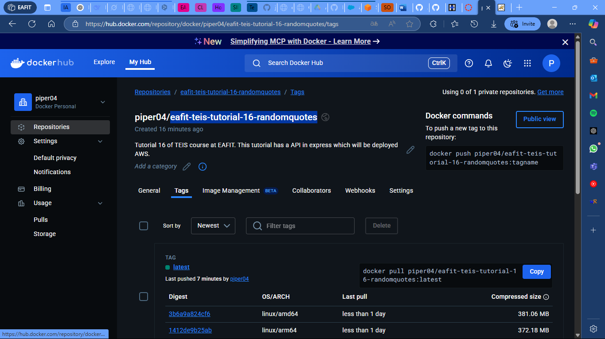
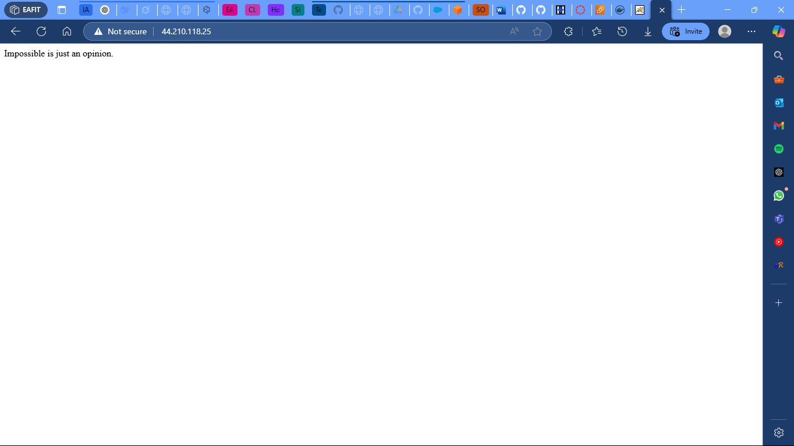

# Tutorial 16: Express and Docker

## Content Table
- [Tutorial 16: Express and Docker](#tutorial-16-express-and-docker)
  - [Content Table](#content-table)
  - [Authors](#authors)
  - [Introduction](#introduction)
  - [Project Structure](#project-structure)
  - [Setup Instructions](#setup-instructions)
    - [Versions](#versions)
    - [Execution](#execution)
    - [Docker Image](#docker-image)
  - [Activities](#activities)
    - [Uploading to Docker Hub](#uploading-to-docker-hub)
    - [Uploading to AWS](#uploading-to-aws)
  - [Contact](#contact)


## Authors

- Juan Felipe Restrepo Buitrago

## Introduction

This folder contains the project in which the 16th tutorial of the Special Topics in Software Engineering Course is developed. This tutorial is about the creation of a simple API system in Express. The part of the tutorial 16 is to upload this API to Docker Hub and run it in AWS EC2.

## Project Structure

```bash
. \
├── node_modules # Node modules. \
├── .gitignore # Git ignore file. \
├── Dockerfile # Dockerfile to build the image. \
├── .dockerignore # Docker ignore file. \
├── .gitignore # Git ignore file. \
├── index.js # Main file. \
├── package.json # Node dependencies. \
├── package-lock.json # Node dependencies lock file. \
└── README.md # Readme file. \
```

## Setup Instructions

### Versions

This were the versions used to develop the project:

- Node v20.15.1
- Docker v28.0.4

### Execution

To run follow these steps:

1. Clone the repository (If you already have the project, skip this step):

SSH
```bash
git clone git@github.com:JuanFelipeRestrepoBuitrago/Software-Topics.git
```
or HTTP

```bash
git clone https://github.com/JuanFelipeRestrepoBuitrago/Software-Topics.git
```

2. Go to the workshop1 folder:

```bash
cd $PROJECT_PATH/tutorials/tutorial16
```

3. Install the dependencies:

```bash
npm install
```

4. Run the project:

```bash
npm run start
```

5. Open the browser and go to http://localhost:8080/

### Docker Image

I already uploaded the image to Docker Hub, so you can run it without building it. To do this, run the following command:

```bash
docker run -d --name randomquotes-tutorial16 -p 8080:8080 piper04/eafit-teis-tutorial-16-randomquotes:latest
```

## Activities
 
### Uploading to Docker Hub

I have created a Dockerfile to build the project and upload it to Docker Hub. The Dockerfile is located in the root folder of the project. To build the image, run the following command:

```bash
docker build -t <your_dockerhub_username>/eafit-teis-tutorial-16-randomquotes .
```

Then, to upload the image to Docker Hub, run the following command:

```bash
docker push <your_dockerhub_username>/eafit-teis-tutorial-16-randomquotes
```

My docker images can be found at [piper04/eafit-teis-tutorial-16-randomquotes](https://hub.docker.com/repository/docker/piper04/eafit-teis-tutorial-16-randomquotes).



### Uploading to AWS

I also created an instance of AWS EC2 to run the Docker image. The instance is running Ubuntu 22.04 and has Docker installed. To run the image, follow these steps:

To access the express application, you can use the [link](http://13.218.27.14/) or the ip 13.218.27.14.



## Contact

For any questions or issues, feel free to reach out to:
- Juan Felipe Restrepo Buitrago: [jfrestrepb@eafit.edu.co](jfrestrepb@eafit.edu.co)